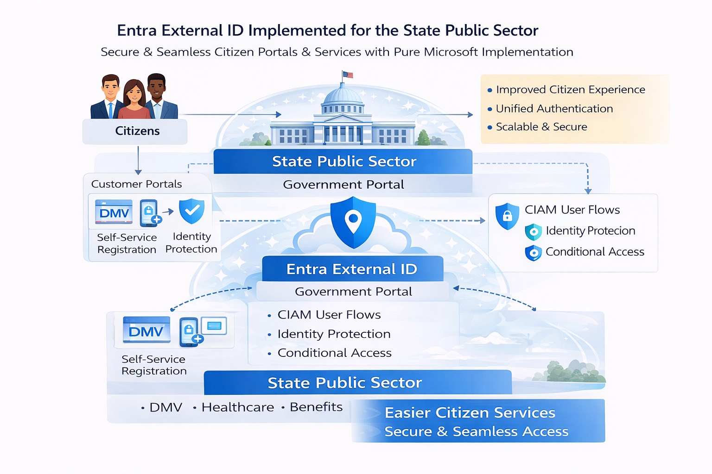

## Architecture Overview

This architecture demonstrates a **citizen-only CIAM implementation** using
**Microsoft Entra External ID** for U.S. state public sector organizations.

The solution enables secure, scalable, and user-friendly access to
customer-facing government portals such as **DMV, Healthcare, and Benefits**
applications.

## Key Capabilities
- CIAM user flows for citizen registration and sign-in
- Identity Protection for risk-based access decisions
- Conditional Access enforcing Zero Trust policies
- Pure Microsoft implementation (no third-party IdPs)
  
## Whitepaper
📄 **Download PDF**  
[Entra ID as an Identity Control Plane – State Public Sector](entra-id-identity-control-plane.pdf)
